# Laporan pertemuan ke -1 sistem operasi
**Tanggal:** 18 Februari 2026  
**Disusun Oleh:** Rofiq Aristiyawan
**NIM:** 254107020060
**Kelas/No:** TI-1G/27

## 1. Praktikum 2.1 — instalasi virtual box
1. download oracle virtual box:
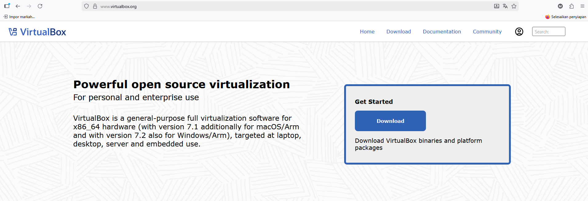

2. install virtual box:

- 

- 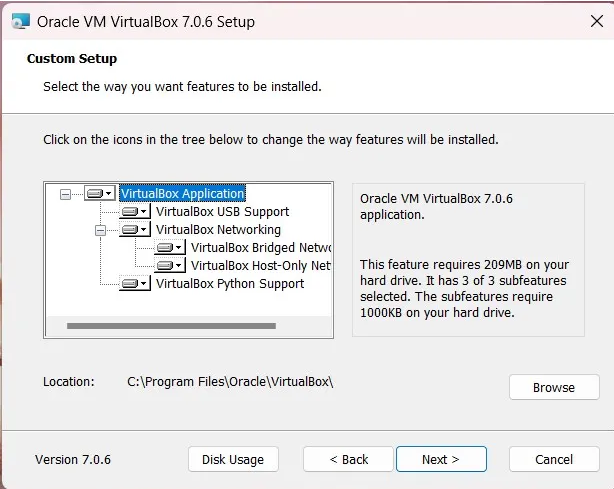

- 

- 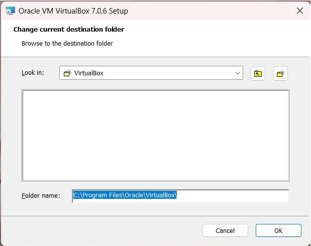

- 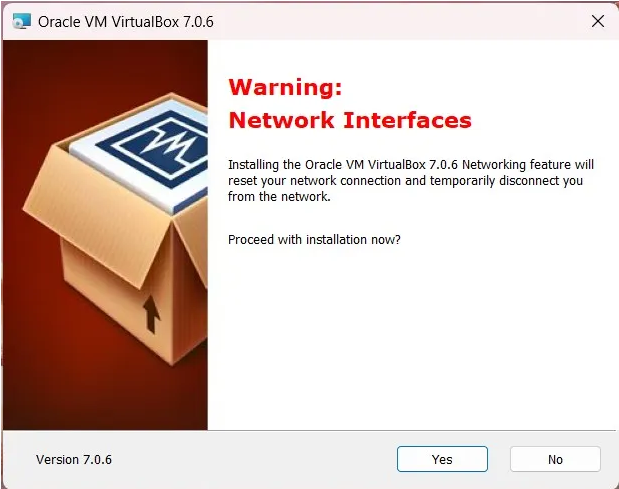

- 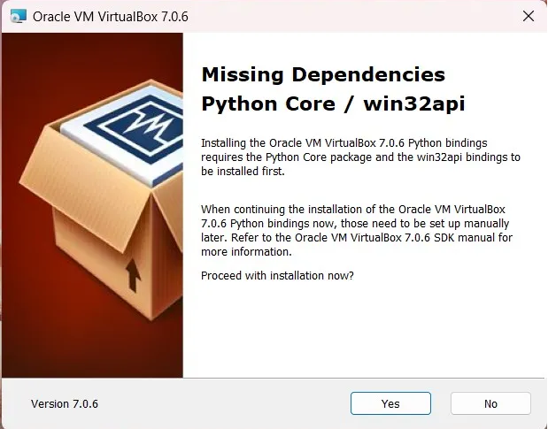

- 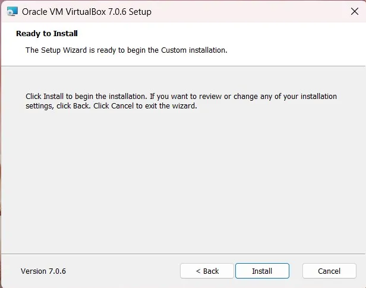

- 

## 2. Praktikum 2.2 - Instalasi Ubuntu server di virtual box

- 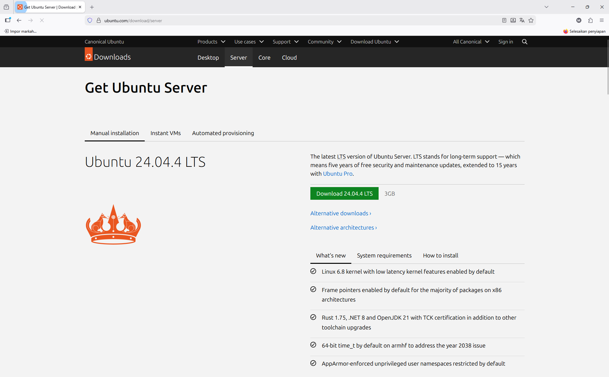

- 

- 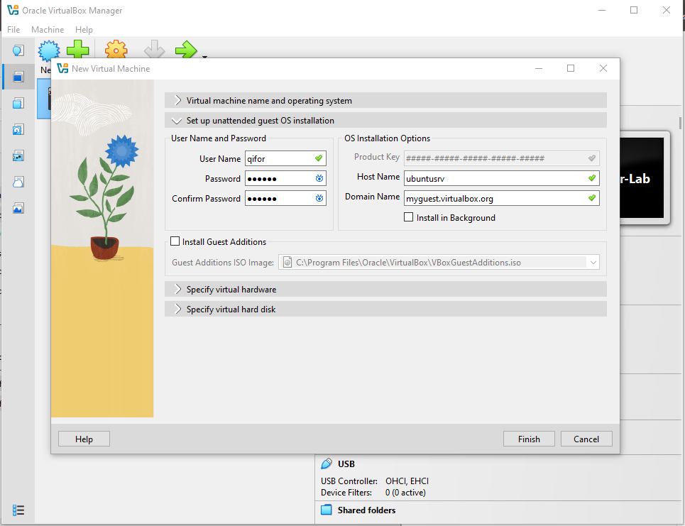

- 

- 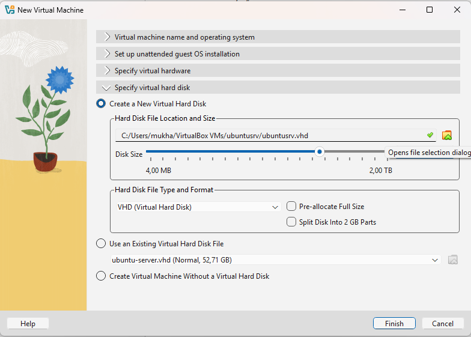

- 

- 

- 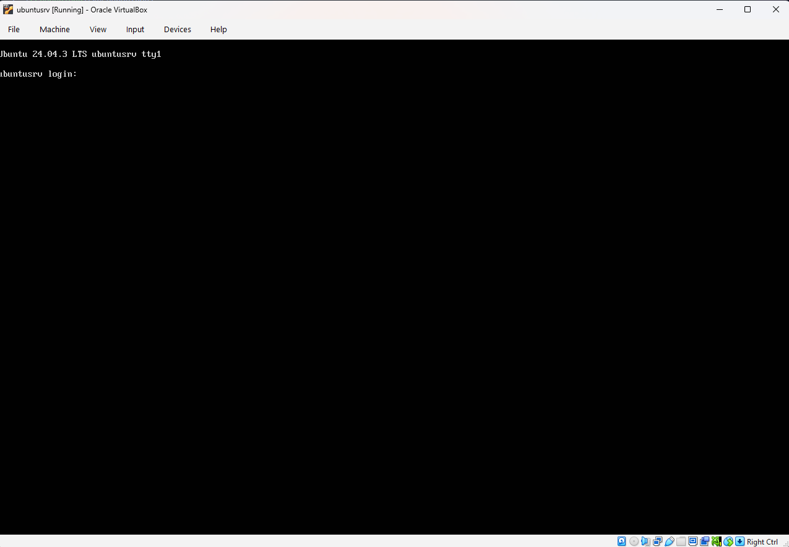

- 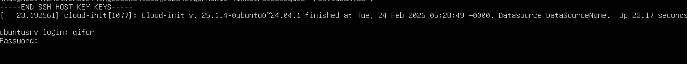

## 2. latihan 
2.1 latihan konseptual
1.1 jelaskan 5 fungsi utama sistem operasi dengan contoh konkret dari minimal 2 OS berbeda (Windows, macOS, atau Linux).
jawab : 
1. Manajemen Proses!
OS bertugas membagi jatah otak (CPU) ke aplikasi.

    Windows: Kalau ada aplikasi macet, kamu buka Task Manager (Ctrl+Shift+Esc) buat "End Task". Windows cenderung otomatis mengatur prioritas.

    Linux: Kamu lebih punya kendali penuh. Kamu bisa pakai perintah ps untuk lihat nomor identitasnya PID, lalu menghentikannya dengan kill. Linux sangat efisien menjalankan banyak proses di background.

2. Manajemen Memori!
OS mengatur siapa yang boleh pakai RAM.

    Windows: Punya fitur Virtual Memory, Kalau RAM habis, dia pakai harddisk buat bantu-bantu. Kadang terasa melambat kalau RAM-nya kecil.

    Linux: Punya area khusus namanya Swap Partition, Linux sangat pintar membebaskan RAM yang sudah tidak terpakai cache supaya sistem tetap enteng.

3. Manajemen File!
Cara kedua OS ini "merapikan lemari" sangat berbeda:

    Windows: Pakai sistem Drive (C:, D:, dst.). File sistemnya biasanya NTFS. Nama file Tugas.txt dan tugas.txt dianggap sama.

    Linux: Tidak ada Drive C:. Semuanya dimulai dari root. File sistemnya biasanya Ext4. Nama file Tugas.txt dan tugas.txt dianggap berbeda.

4. Manajemen I/O & Driver!
Gimana OS ngobrol sama mouse, printer, atau GPU.

    Windows: Kamu sering harus download file .exe atau .msi dari website resmi brand-nya supaya hardware jalan maksimal.

    Linux: Sebagian besar driver sudah menyatu di dalam Kernel. Jadi biasanya colok printer atau wifi langsung jalan tanpa instal apa-apa.

5. Manajemen Keamanan!
Benteng pertahanan OS.

    Windows: Karena penggunanya paling banyak, dia sering jadi sasaran virus. Makanya ada Windows Defender yang selalu standby scan file .exe.

    Linux: Keamanannya ketat di level Izin. Kamu tidak bisa mengubah sistem tanpa perintah sudo. Virus susah masuk karena file .exe Windows tidak bisa jalan di Linux secara langsung.

1.2 Kapan sebaiknya menggunakan Windows vs Linux vs macOS? Analisis berdasarkan use case: gaming, development, server, creative work, dan enter-prise.
jawab : 
### Analisis Pemilihan OS Berdasarkan Use Case

| Use Case | OS Utama | Alasan Utama |
| :--- | :--- | :--- |
| **Gaming** | Windows | Kompatibilitas game yang luas & dukungan Driver GPU terbaru. |
| **Development** | Linux / macOS | Lingkungan berbasis Unix yang stabil & ramah bagi programmer. |
| **Server** | Linux | Efisiensi tinggi, keamanan lebih terjaga, & bersifat open-source. |
| **Creative** | macOS | Ekosistem software kreatif yang matang & akurasi warna layar. |
| **Enterprise** | Windows | Dominasi aplikasi Office & kemudahan IT Management (Active Directory). |

## 2.2 Latihan Praktikal
2.1 Install Ubuntu Server 24.04.3 di VirtualBox dengan langkah berikut:
1. Download Ubuntu Server ISO dari website resmi
2. Create VM baru di VirtualBox (RAM: 2GB, Disk: 25GB)
3. Install dengan automatic partitioning (guided)
4. Buat user account dengan password yang kuat
5. Reboot dan login ke sistem
6. Dokumentasikan proses instalasi dengan screenshot key steps

jawab : tutorial sudah saya buat diatas

2.2 Setelah instalasi Ubuntu Server, lakukan tasks berikut:
1. Update package list: sudo apt update
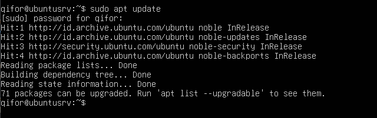

2. Upgrade packages: sudo apt upgrade
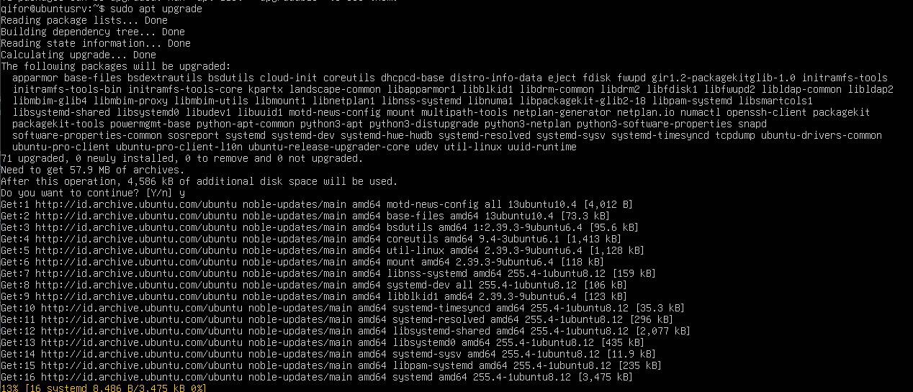

3. Install neofetch: sudo apt install neofetch
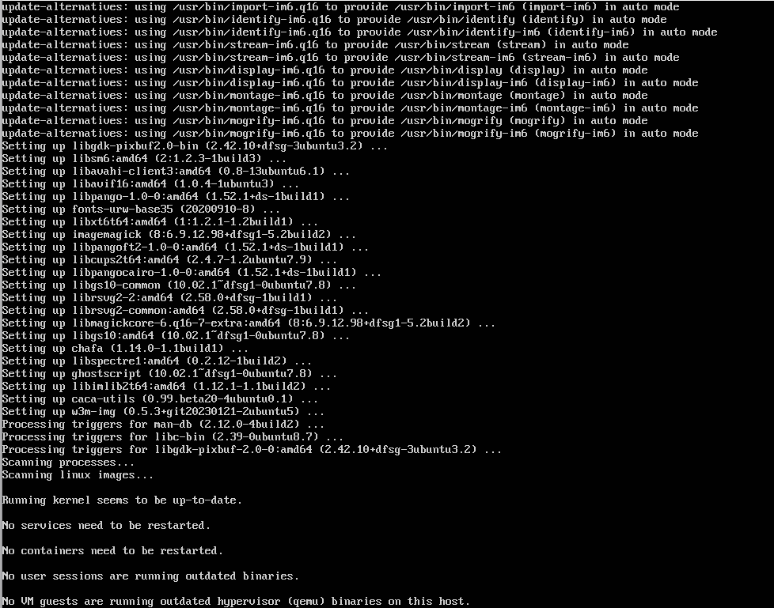

4. Jalankan neofetch dan screenshot hasilnya
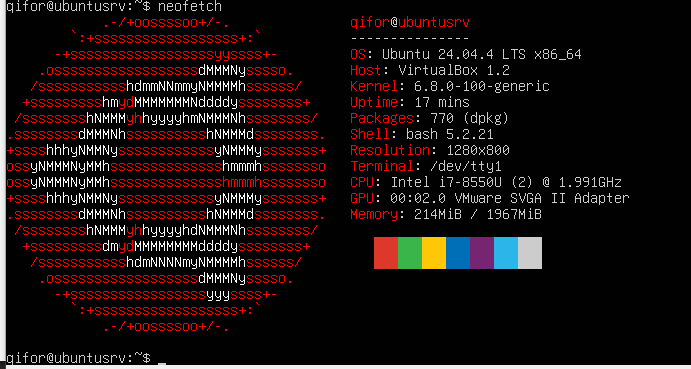

5. Check disk usage dengan df -h
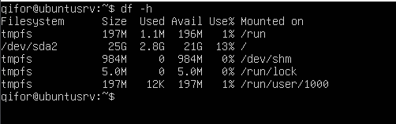

6. Check memory dengan free -h
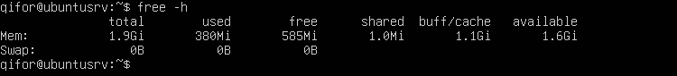

7. Dokumentasikan output dari setiap command
jawab : sudah

2.3 Eksplorasi sistem yang baru diinstall:
1. Tampilkan informasi OS: cat /etc/os-release
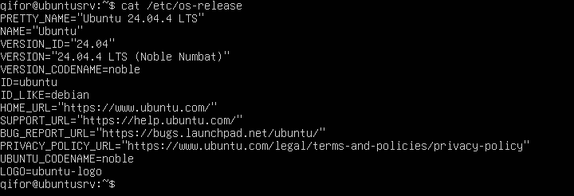
berdasarkan informasi yang saya lakukan informasi os saya memakai ubuntu versi 24.04

2. Tampilkan versi kernel: uname -r
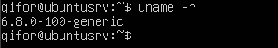
berdasarkan informasi yang saya lakukan kernel saya 6.8.0-100-generic

3. List partisi: lsblk
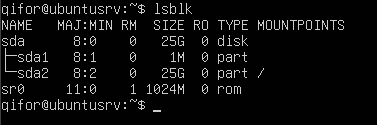
Berikut adalah struktur penyimpanan pada server:

| Nama | Ukuran | Jenis | Mountpoint |
| :--- | :--- | :--- | :--- |
| sda | 25G | Disk | - |
| sda2 | 25G | Partisi | / sr0 |

4. Check network connectivity: ping -c 4 google.com
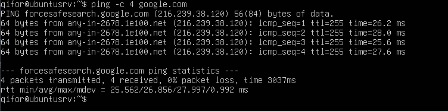
berdasarkan pengecekan /ping ke google tercatat berhasil tidak rto

5. Install dan jalankan htop untuk melihat resource usage
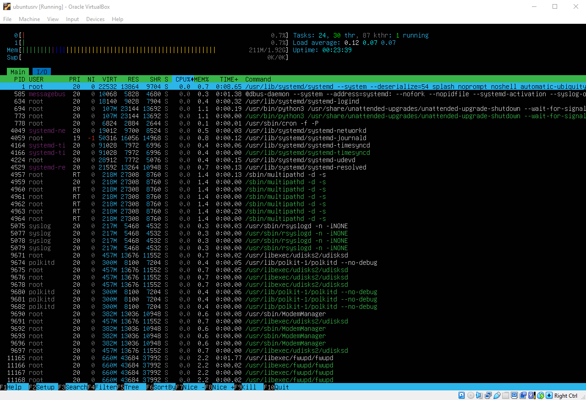

6. Buat laporan singkat tentang konfigurasi sistem Anda
jawab : sudah

## 2.3 Latihan Refleksi
Ceritakan pengalaman Anda dengan sistem operasi:
1. Sistem operasi apa yang Anda gunakan sehari-hari? (Windows, macOS,
Linux, atau lainnya)
jawab : 
Waktu pertama kali menggunakan windows dan sampai sekarang sudah nyaman di windows.

2. Berapa lama Anda menggunakan sistem operasi tersebut?
jawab :
saya memakai windows sejak bermain warnet waktu 2014.

3. Apa yang Anda sukai dari sistem operasi tersebut?
jawab :
Karna sudah nyaman.

4. Apa tantangan atau masalah yang pernah Anda hadapi?
jawab :
Kalau lupa maintenance maka akan lemot untuk kinerja nya.

5. Apakah Anda pernah menggunakan sistem operasi lain? Bandingkan pengalaman Anda.
jawab :
Belum.

6. Setelah mempelajari bab ini, apakah ada sistem operasi lain yang ingin Anda coba? Mengapa?
jawab :
Linux, dikarenakan linux sangat menarik karena memberikan kebebasan penuh kepada penggunanya yang jarang ditemukan di operasi sistem yg lain.

Tulis refleksi Anda dalam 300-500 kata disertai dengan dokumentasi.
jawab : Ketertarika saya pada sistem operasi sebenernya berakar sejak masa sekolah di SMK jurusan TKJ. Namun, pemahaman saya benar-benar diuji saat saya terjun ke industri ISP sebagai NOC. Di sana, saya sadar bahwa di balik internet yang stabil, ada sistem operasi yang bekerja tanpa henti.
Dulu di sekolah, fokus saya mungkin masih seputar instalasi Windows yang visualnya mudah dipahami. Namun, realitas di ISP memaksa saya untuk berpindah ke CLI. Mengelola server lewat terminal ternyata jauh lebih responsif dan minim gangguan dibandingkan Windows yang seringkali terbebani oleh background process atau update yang tidak terduga. Proxmox pun menjadi penemuan penting bagi saya; sebuah hypervisor berbasis Debian yang sangat efisien untuk membagi beban kerja server.
Dalam praktikum kali ini, menjalankan perintah seperti lsblk untuk manajemen disk atau htop untuk memantau performa sistem terasa seperti mengulang rutinitas harian saya di ruang server. Bagi seorang teknisi jaringan, perintah-perintah ini adalah alat diagnosa paling jujur untuk melihat kondisi kesehatan perangkat sebelum terjadi downtime.
Ke depannya, saya ingin mengombinasikan bekal dari SMK dan pengalaman kerja ini untuk eksperimen yang lebih kompleks. Saya berencana mengintegrasikan MikroTik RouterOS ke dalam ekosistem virtual Proxmox. Fokus saya adalah mendalami manajemen traffic dan penguatan keamanan pada level kernel. Saya percaya bahwa penguasaan sistem operasi yang mendalam adalah pondasi wajib untuk membangun jaringan berskala besar."

dokumentasi : Waktu di SMK dulu saya dipondok jadi tidak memiliki foto nya dikarenakan tidak boleh bawa hp.