# Laporan pertemuan ke -2 sistem operasi
**Tanggal:** 18 Februari 2026  
**Disusun Oleh:** Rofiq Aristiyawan
**NIM:** 254107020060
**Kelas/No:** TI-1G/27

## 1.1 Deteksi Perangkat Keras di Linux

## 1. Praktikum 2.1 — Identifikasi CPU dan Memori
1. tampilan informasi cpu:

2. tampilan ringkasan memori:
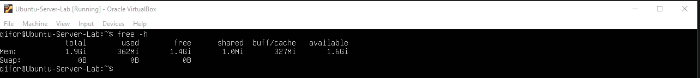

3. cek informasi hardware dari DMI/BIOS:
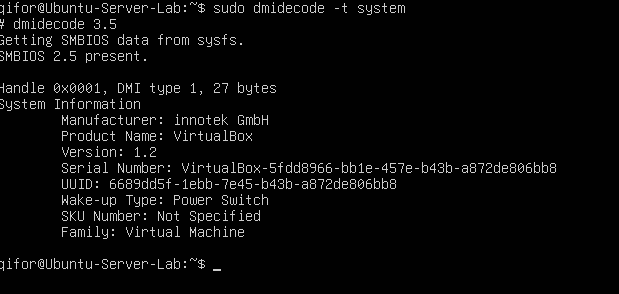

4. Catat: (1) jumlah CPU(s), core/thread, (2) total RAM, (3) total swap. Jelaskan perbedaan RAM vs swap dalam 2–3 kalimat.

jawab : jumlah cpu = 2, core/thread = 2/1, swap = 4GB.
Perbedaan utama antara RAM dan Swap terletak pada fungsi dan kecepatannya:
RAM (Random Access Memory): Merupakan memori utama fisik berkecepatan tinggi yang digunakan untuk menyimpan data aplikasi yang sedang aktif agar dapat diakses instan oleh prosesor.
Swap Memory: Merupakan area di media penyimpanan (HDD atau SSD) yang berfungsi sebagai perluasan atau cadangan ketika kapasitas RAM sudah penuh.

## 2.2 — Identifikasi Perangkat PCI/USB dan Driver
1. Lihat daftar perangkat PCI:
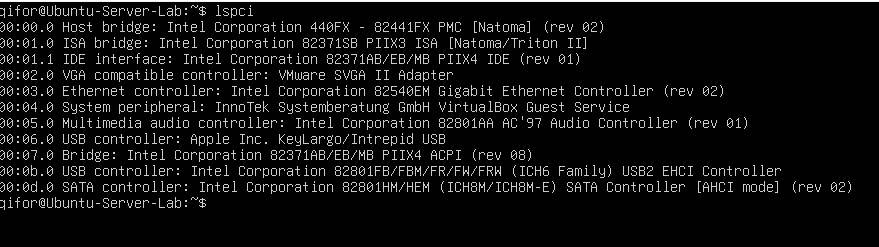

2. Lihat perangkat PCI beserta driver kernel yang digunakan:
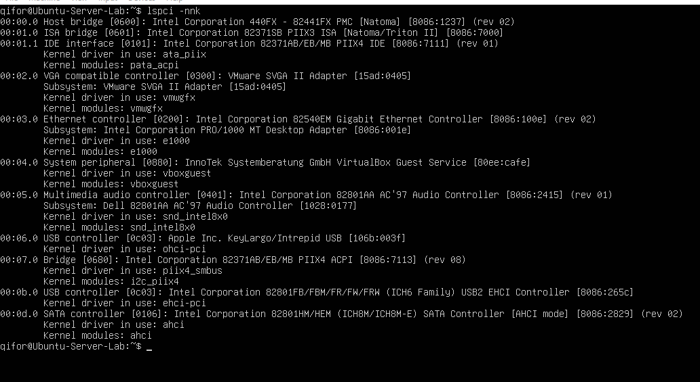

3. Fokus pada NIC (Ethernet) untuk mencari modul driver:
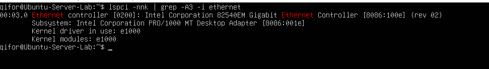

4. Lihat perangkat USB:
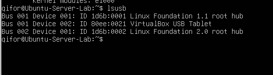

5. Lihat topologi USB (tree):
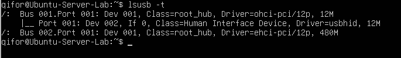

6. Temukan 1 perangkat PCI (misal NIC) dan tuliskan: Vendor:Device ID (angka heksadesimal), nama driver/modul kernel, dan deskripsi singkat fungsinya.

jawab : Nama perangkat = Intel Corporation 82540EM Gigabit Ethernet Controller, vendor:device id = 8086:100e, kernel driver = e1000, kernel moduls = e1000.
Deskripsi singkat& fungsi = pengontrol jaringan berkecepatan tinggi yang memungkinkan sistem untuk melakukan pertukaran data secara stabil. Fungsinya agar Ubuntu dapat memperoleh alamat IP melalui protokol DHCP dan memungkinkan akses jarak jauh melalui SSH.

## 2.3 — Identifikasi Storage dan Filesystem
1. Lihat daftar disk/partisi:
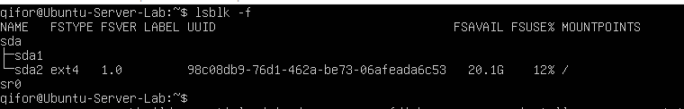

2. Tampilkan UUID dan tipe filesystem:
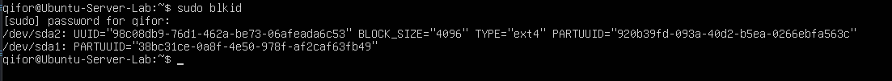

3. Lihat mount point untuk root filesystem:
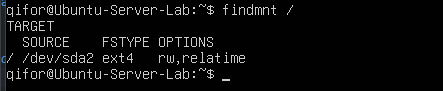

## 2.4 — Melihat Modul Aktif dan Informasinya
1. Cek versi kernel:
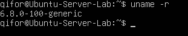

2. Tampilkan daftar modul aktif:
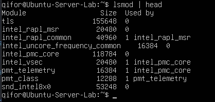

3. Pilih salah satu modul (contoh aman: loop) dan lihat detailnya:
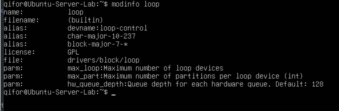

4. Muat modul (jika belum aktif), lalu verifikasi:
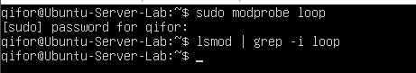

5. (Opsional) lihat pesan kernel terbaru:
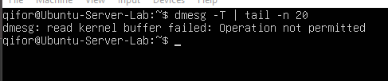

## 2.5 — Konfigurasi Auto-load dan Blacklist:
1. konfigurasi autoload dan blacklist modul
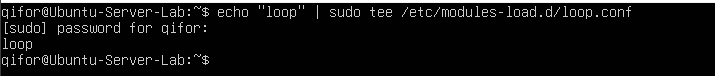

## 2.6 — Mengenali block vs character  device:
1. Lihat detail salah satu disk (sesuaikan dengan perangkat Anda, misal sda):
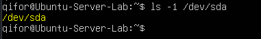

2. Lihat detail device terminal:
 

3. Lihat disk dan partisi untuk mengaitkan dengan /dev:
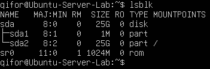

4. Dari output ls -l, jelaskan perbedaan penanda file untuk block device dan
character device. (Hint: karakter pertama pada permission string)

jawab : ls -l /dev/sda	karakter pertama b jenis filenya Block Device (Penyimpanan),
        ls -l /dev/tty	karakter pertama c jenis filenya Character Device (Terminal)

## 2.7 — Melihat Informasi udev:
1. Cek atribut udev untuk disk:
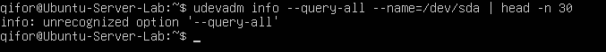

2. (Opsional) monitor event udev (jalankan, lalu colok/lepas USB pada mesin
fisik):
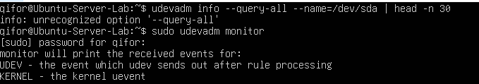

## 2.8 — Membuat Workspace Praktikum:
1. Buat direktori praktikum dan masuk ke dalamnya:
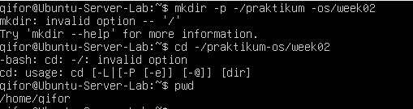

2. Buat beberapa file contoh:
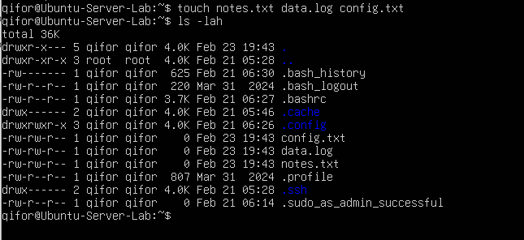

3. Isi file log contoh (simulasi):
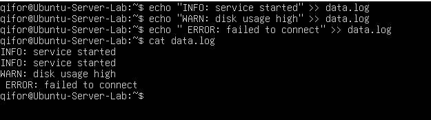

4. Baca file dengan less:
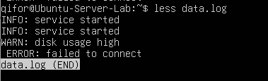

## 2.9 — Pencarian Pola dengan grep
1. cari barisan error,warn,info dengan grep:
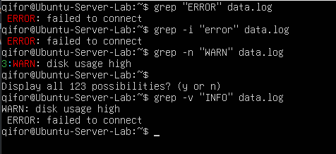

2. Gunakan grep untuk menampilkan hanya baris yang mengandung INFO atau
WARN dari data.log. (Hint: gunakan grep -E dengan pola alternatif)

jawab: untuk menggunakan alternatif or kita menggunakan opsi -E dan | berfungsi sebagai atau.  berikut contohnya:
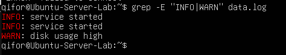

## 2.10 — Substitusi dengan sed (Aman di File Latihan)
1. konfigurasi langkah 1-4:
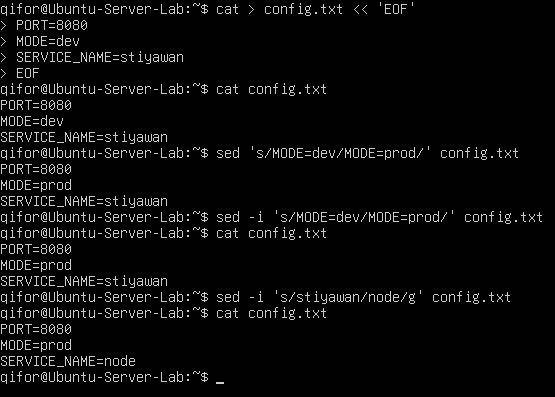

2. Gunakan sed -i dengan hati-hati jika mengedit file sistem. Untuk administrasi
nyata, praktik aman adalah membuat backup: sed -i.bak ’s/old/new/g’
file.conf

jawab: hasil backup
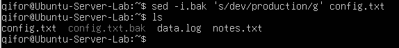

## 2.11  — Ekstraksi Kolom dengan awk
1. langkah 1-3 hasil:
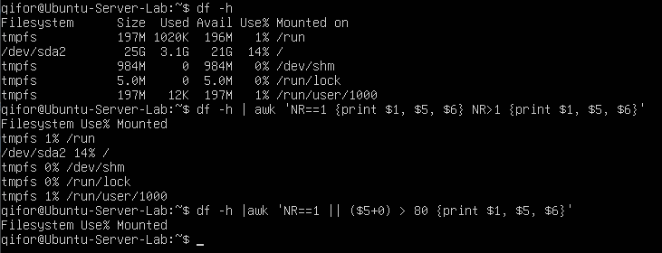

## 2.12 — Melihat Proses dengan ps
1. langkah 1-2 hasil:
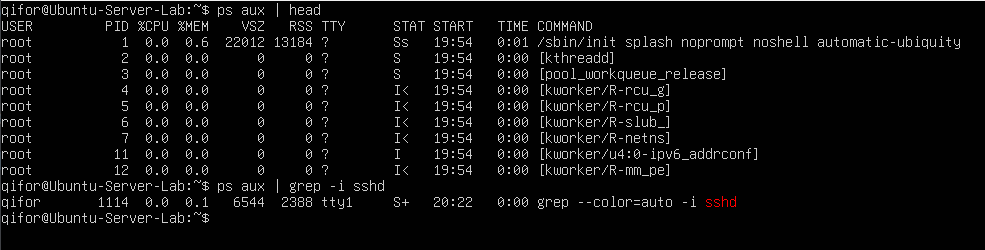

## 2.13 — Monitoring Real-time dengan top
1. Jalankan top:
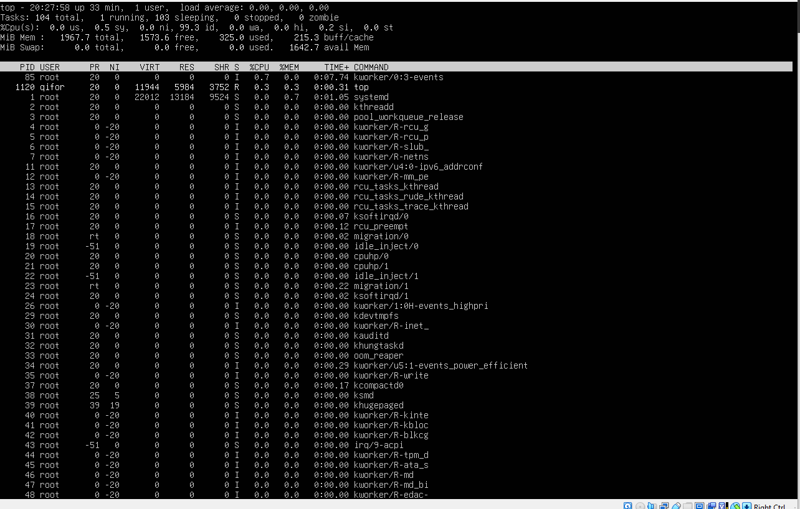

## 2.14 — Menghentikan Proses dengan kill
1. langkah 1-5 hasil:
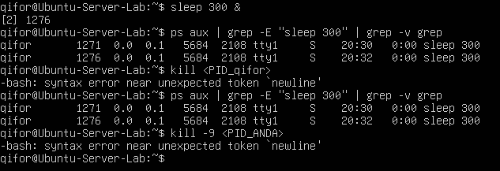

## 2.15 — Cek Disk, Load, dan Service
1. Cek penggunaan disk:
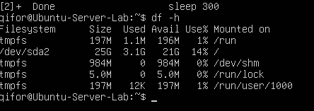

2. Cari direktori yang besar (contoh pada /var):
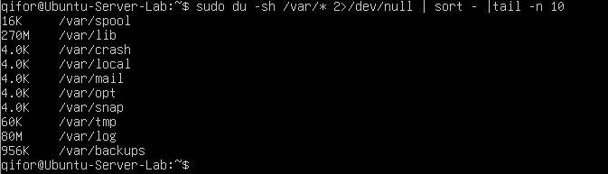

3. Cek load dan uptime:
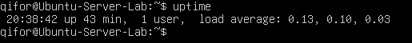

4. Cek service yang gagal:
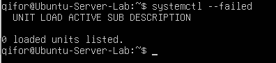

5. Ambil log error terbaru:
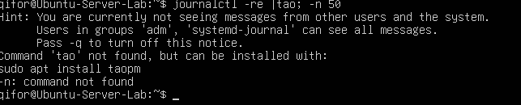

## 2.16 — Monitoring Port dan Koneksi (Network Basics)
1. langkah 1-3 hasil:
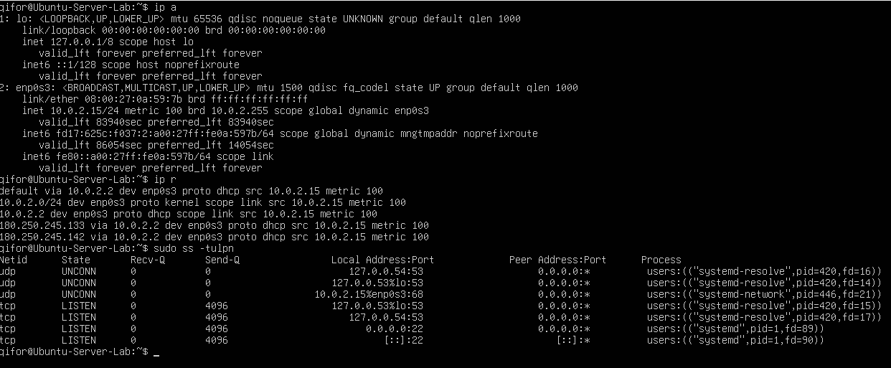

2. Pilih satu port yang listening dari output ss -tulpn(misal port 22), lalu
tuliskan service/proses yang membukanya. Jelaskan kegunaan port tersebut
secara singkat.

jawab: Port 22 dibuka oleh proses sshd, Port ini digunakan untuk layanan ssh yang memungkinkan akses remote ke server secara aman melalui jaringan.

## 1.9 Latihan
1. 2.A Jalankan lspci -nnk. Pilih 1 perangkat PCI dan tuliskan: nama perangkat, ID vendor:device, dan kernel driver in use.
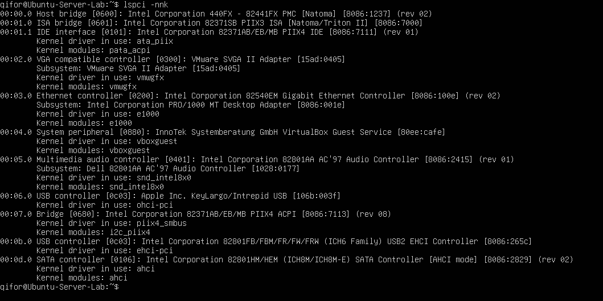
jawab: Nama perangkat: Intel 82540EM Gigabit Ethernet Controller, ID vendor: device: 8086:100e, Kernel driver in use: e1000.

2. 2.B Tentukan device root filesystem dengan findmnt /. Lalu cocokkan dengan lsblk -f dan tuliskan tipe filesystem serta UUID-nya.
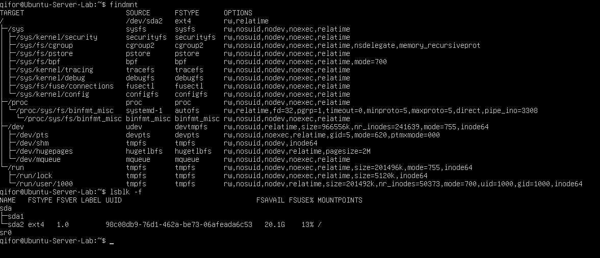
jawab: Device = /dev/sda2, FSTYPE = ext4, UUID = 98c08db9-76d1-462a-be73-06afeada6c53.

3. 2.C Buat file server.log berisi minimal 10 baris dengan variasi kata: INFO, WARN, ERROR. Gunakan grep untuk menampilkan hanya baris ERROR.
- 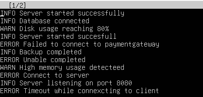
- 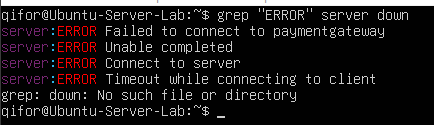

4. 2.D Gunakan sed untuk mengganti semua kata server menjadi node pada file latihan. Tunjukkan sebelum dan sesudah.
- 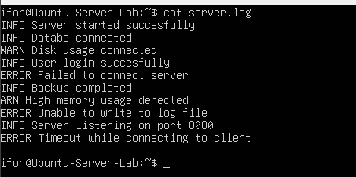
- 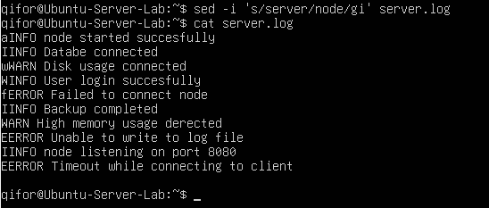

5. 2.E Gunakan df -h lalu awk untuk menampilkan filesystem yang penggunaan disk di atas 70%.
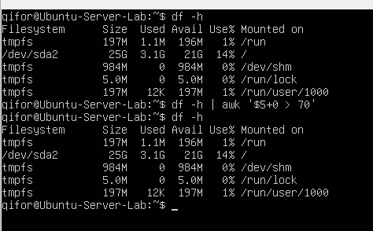

6. 2.F Jalankan sleep 600 &. Temukan PID-nya dengan ps. Hentikan dengan SIGTERM. Jelaskan beda SIGTERM vs SIGKILL.
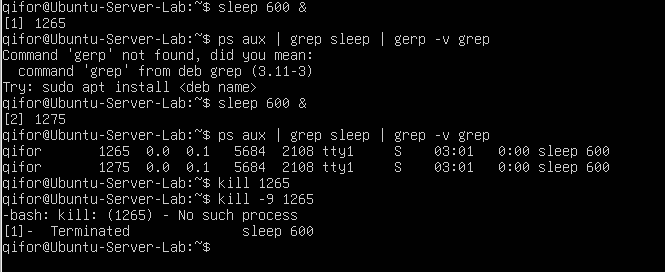
perbedaan sigterm dan sigkill = SIGTERM : proses bisa cleanup dulu
                                SIGKILL : langsung paksa mati 

7. 2.G Gunakan systemctl –failed. Jika tidak ada yang gagal, pilih satu service aktif (misal ssh) dan tampilkan status serta 30 baris log terakhirnya.
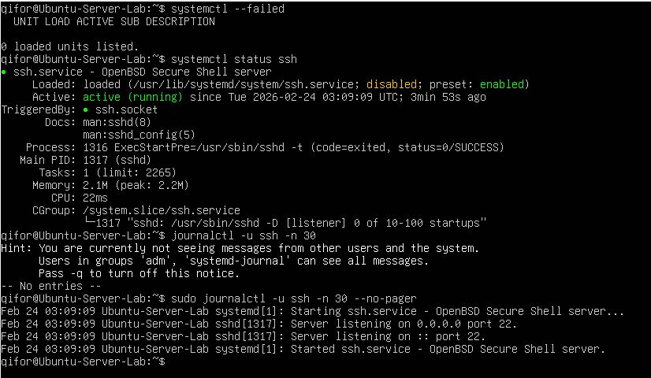